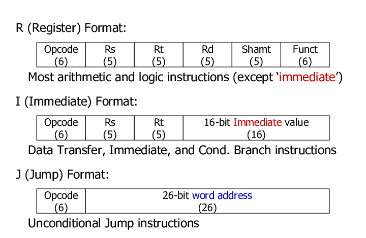
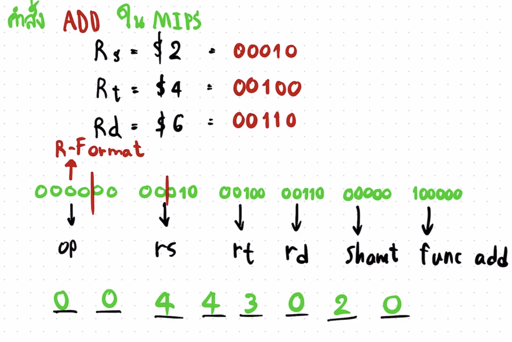

# Computer-Architecture
## CLIP 1
<br>[Click here CLIP1](https://www.youtube.com/watch?v=4Xmycxsm4yo)
<br>
*คำสั่ง ADD ใน MIPS  จะอยู่ในคำสั่ง R-format จะประกอบด้วย 
    1.$rs(register rs) จะเก็บบิทขนาด 5 บิท
    2.$rd(register rd) จะเก็บบิทขนาด 5 บิท
    3.$rt(register rt) จะเก็บบิทขนาด 5 บิท
 
 
 <br>โดยคำสั่งใน MIPs จะเก็บด้วยตัวเลยจำนวน 32 บิท โดย 6 บิทเเรกจะเป็น 000000 คือ opcode ตามด้วย rs rt rd shamt(ขนาด 5 บิท) เเละ func ขนาด 6 บิท หลังจากนั้นเราจะเเปลงเป็นเลขฐาน 16 โดยการเเปลงทีละ 4 บิท
 
 
*************************************************************************************************************************************************************************************************************************************************************************************************************************************************************************
## CLIP 2
<br>[Click here CLIP2](https://www.youtube.com/watch?v=0mXmTB-i86c&t=37s)
*************************************************************************************************************************************************************************************************************************************************************************************************************************************************************************
## CLIP 3
<br>[Click here CLIP3](https://www.youtube.com/watch?v=90x-axC5oNs&t=4s)
```
111111111111111111111111111111111111111111111111112222222222222222222222222222222222222222222222333333333333333333333333333333333333333333332222222222222222222222222222222222222222222222222222222222222222
```
*************************************************************************************************************************************************************************************************************************************************************************************************************************************************************************
## CLIP 4
<br>[Click here CLIP4](https://www.youtube.com/watch?v=WPbhgIni8XY&t=61s)
*************************************************************************************************************************************************************************************************************************************************************************************************************************************************************************
## CLIP 5
<br>[Click here CLIP5](https://www.youtube.com/watch?v=IW1H2A5DxqA&t=4s)
*************************************************************************************************************************************************************************************************************************************************************************************************************************************************************************
## CLIP 6
<br>[Click here CLIP6](https://www.youtube.com/watch?v=NIqQllKFryg&t=1s)
*************************************************************************************************************************************************************************************************************************************************************************************************************************************************************************
## CLIP 7
<br>[Click here CLIP7](https://www.youtube.com/watch?v=OmpTHug1bIA&t=2s)
*************************************************************************************************************************************************************************************************************************************************************************************************************************************************************************
