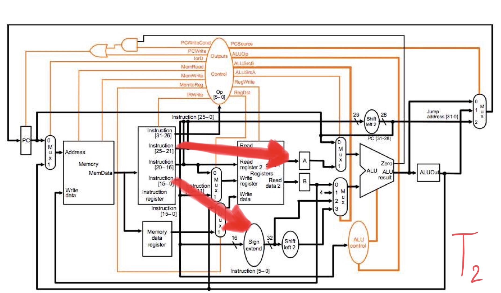
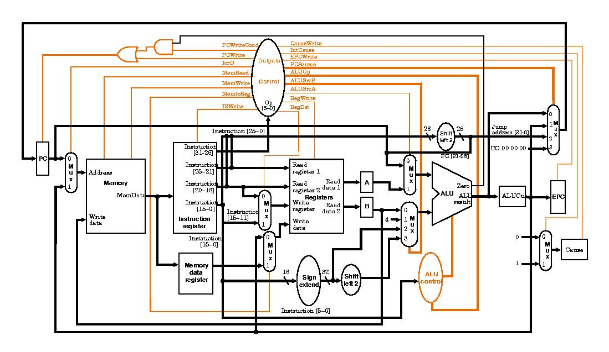

# Computer-Architecture
## CLIP 1
<br>[Click here CLIP1](https://www.youtube.com/watch?v=4Xmycxsm4yo)
<br>
<br>คำสั่ง ADD ใน MIPS  จะอยู่ในคำสั่ง R-format จะประกอบด้วย 
<br>1.$rs(register rs) จะเก็บบิทขนาด 5 บิท
<br>2.$rd(register rd) จะเก็บบิทขนาด 5 บิท
<br>3.$rt(register rt) จะเก็บบิทขนาด 5 บิท
 
 
 <br>โดยคำสั่งใน MIPs จะเก็บด้วยตัวเลยจำนวน 32 บิท โดย 6 บิทเเรกจะเป็น 000000 คือ opcode ตามด้วย rs rt rd shamt(ขนาด 5 บิท) เเละ func ขนาด 6 บิท หลังจากนั้นเราจะเเปลงเป็นเลขฐาน 16 โดยการเเปลงทีละ 4 บิท
 
 
*************************************************************************************************************************************************************************************************************************************************************************************************************************************************************************
## CLIP 2
<br>[Click here CLIP2](https://www.youtube.com/watch?v=0mXmTB-i86c&t=37s)

<br>โดยทั่วไปคอมพิวเตอร์ จะสามารถทำงานเเละเข้าใจคำสั่งโดย ใช้ภาษา Machine Language โดยภาษาที่เรามนุษย์ เขียนจะเป็นภาษาชั้นสูงเช่น JAVA,PYTHON,C,C+,C++,C#

<br>จากรูปเราใช้ถาษาจาวา
```
=====Java Language
Class Test {
    Public static void main(String[] args){
      int a = 10 ;
      int b = 20 ;
      int c = a+b ;
=====Machine Language (in memory)
00000000:      j 01000000
00000004:      1A000000         //data
...
01000000:      lw $9, $0(4)
01000004:      lw $1, $9(0)     // $1,a = 10
01000008:      lw $2, $9(4)     // $2,b = 20
0100000C:      add $3, $1, $2
01000010:      sw $3, $9(8)
...
1A000000:      0000000A         //a
1A000004:      00000014         //b
1A000008:      00000000         //c
```
<br>1.โดยจากรูป คำสั่งเเรกจะมาที่  00000000 คือคำสั่ง jump ไปที่ 01000000
<br>2.บรรทัดที่ 3 lw $9, $0(4) หมายถึง นำข้อมูลใน 00000004 ที่อยู่ในบรรที่2 ก็คือ 1A000000 เก็บในรีจิสเตอร์ 9
<br>3.บรรทัดที่ 4 lw $1, $9(0) หมายถึง นำข้อมูลในตำแหน่ง 1A000000 คือ 0000000A ค่าa ที่เท่ากับ10ในฐาน16 เก็บในรีจิสเตอร์ 1
<br>4.บรรทัดที่ 5 lw $2, $9(4) หมายถึง นำข้อมูลในตำแหน่ง 1A000000บวกไป 4 บิท ก็คือ 1A000004 ซึ่งเก็บค่าฺb ที่เท่ากับ00000014 หรือ20 ในฐาน10 เก็บในรีจิสเตอร์ 2
<br>5.บรรทัดที่ 6 add $3, $1, $2 หมายถึง นำข้อมูลใน รีจิสเตอร์1 และ รีจิสเตอร์2 บวกกัน แล้วนำค่าไปเก็บใน รีจิสเตอร์3
<br>6.บรรทัดที่ 7 sw $3, $9(8) หมายถึง นำข้อมูลในรีจิสเตอร์3 เก็บค่าในตำแหน่ง 1A000000 บวก8 คือ1A000008 เก็บค่าผลลัพธ์ ค่า c ที่เท่ากับ30


*************************************************************************************************************************************************************************************************************************************************************************************************************************************************************************
## CLIP 3
<br>[Click here CLIP3](https://www.youtube.com/watch?v=90x-axC5oNs&t=4s)

### Single Cycle
<br>
```
ลักษณะของ Single Cycle
- 1 คำสั่ง = 1 Cycle
- มี Memory 2 ตัว
- มี ALU 3 ตัว
- ในทุกๆคำสั่งใช้เวลาเท่ากันทำให้ใช้เวลามากเนื่องจากจะใช้เวลาของคำสั่งที่ทำงานใช้เวลามากสุด
```
### Multi Cycle
<br>
```
ลักษณะของ Multi Cycle
- มี ALU เพียงตัวเดียว
- มี Memory เพียงตัวเดียว
- มีการพักข้อมูลที่ตำแหน่ง a และ b ในรูป
- ใช้เวลาแต่ละคำสั่งไม่เท่ากัน
- มี ALUout ที่เก็บค่าหลังจากคำนวณ
```


*************************************************************************************************************************************************************************************************************************************************************************************************************************************************************************
## CLIP 4
<br>[Click here CLIP4](https://www.youtube.com/watch?v=WPbhgIni8XY&t=61s)

## การทำงานของ LW ใน Multi cycle จะมีอยู่ด้วยกันทั้งหมด 5 cycle ดังนี้

### T1

```
นำข้อมูลที่รับเข้ามาจาก PC แล้วนำไปเก็บไว้ที่ Instruction register
```
### T2

```
นำ $rs ไปไว้ที่ A และนำ offset ไปไว้ที่ Sign extend
```
### T3

```
นำ $rs มาคำนวณกับ offset ที่ ALU แล้วนำผลไปเก็บไว้ที่ ALUOut
```
### T4

```
นำผลจาก ALUOut กลับไปยัง Memory แล้วนำไปไว้ที่ Memory data register
```
### T5

```
นำค่าจาก Memory data register กับ $rt ไปไว้ใน register 
เพื่อทำการนำค่าจาก Memory data register ไปเขียนไว้ที่ $rt
```


*************************************************************************************************************************************************************************************************************************************************************************************************************************************************************************
## CLIP 5
<br>[Click here CLIP5](https://www.youtube.com/watch?v=IW1H2A5DxqA&t=4s)

<br>


*************************************************************************************************************************************************************************************************************************************************************************************************************************************************************************
## CLIP 6
<br>[Click here CLIP6](https://www.youtube.com/watch?v=NIqQllKFryg&t=1s)

<br>

* ขั้นตอนของFSM ใน R-type
<br>ขั้นตอนที่1 การเอาคำสั่งและPC+4 เมื่อMemRead=1 ,IorD=1 (คือ จากPC ไปยัง Memory address), IRWrite=1 (คือจาก Memory ไป Instruction          register),ALUSrcA=0(คือPC), ALUSrcB=1(คือ4), ALUOP= ADD(คิอ PC=PC+4), PCWrite=1 และ PCSource=1 (คือALU)
<br>ขั้นตอนที่2 การถอดรหัสคำสั่ง เมื่อ ALUSrcS=0 (คือ PC), ALUSrcB=3 (คือ signext(IR«2)), ALUOP=0 (คือ add)
<br>ขั้นตอนที่3 คำนวณในALU เมื่อ ALUSrcS=1 (คือ A=Register[$rs]), ALUSrcB=0 (คือ B=Register[$rt]), ALUOP=2 (คือInstruction register[28-26])
<br>ขั้นตอนที่4 เชียนข้อมูลลงรีจิสเตอร์ rd เมื่อ RegWrite=1 (คือ จากALUout ไปที่Register[$rd]), MemtoReg=0 (คือ ALUout), RegDst=1 (คือ rd)


*************************************************************************************************************************************************************************************************************************************************************************************************************************************************************************
## CLIP 7
<br>[Click here CLIP7](https://www.youtube.com/watch?v=OmpTHug1bIA&t=2s)

<br>
<br>จากรูปเป็นการทำงานของการทำงานทีละขั้นตอน โดยจะมีเครื่องซักผ้าเเละเครื่องอบเเห้ง โดยเราจะนำกองผ้า A ใส่ในเครื่องซักผ้าเเละเมื่อซักเสร็จเราจะเอาไปใส่ในเครื่องอบเเห้ง เราจะเห็นได้ว่าเมื่อเรานำกองผ้า A ออกจากเครื่องอบเเห้งเเล้วเครื่องซักผ้า A จะว่างอยู่ทำให้ การทำงานในเเเบบนี้เป็นไปได้อย่างช้า
<br>
การทำงานของ Pipelining โดยเมื่อเเราเอากองผ้า A เข้าไปใส่ที่เครื่องอบเเห้งเเล้วเครื่องซักผ้าตัวเเรกจะว่าง ดังนั้นเราจะเอากองผ้า B ใส่ลงในเครื่องซักผ้าตัวเเรกทำอย่างนี้ต่อไปเรื่อยๆตามขั้นตอนจะเห็นถึงความเเตกต่างของเวลาการทำงานเเบบปกติจะใช้เวลานานกว่าการทำงานของ Pipelining อย่างมาก


*************************************************************************************************************************************************************************************************************************************************************************************************************************************************************************
